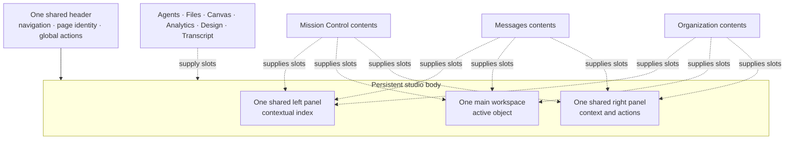
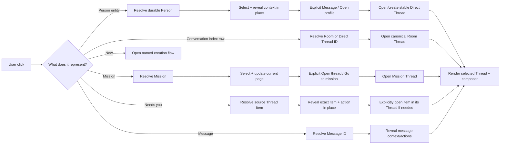
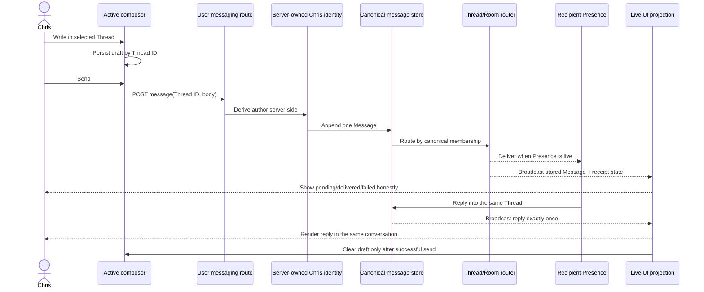
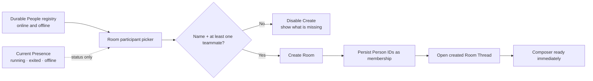

# Messaging recovery plan

## Binding scope

Fix messaging first. Also restore the shared header and side-panel frame because messaging cannot be coherent while every page invents a different shell. Do not redesign or “fix the whole app.”

## Visual reference

The binding spatial reference is [`messaging-shell-reference.svg`](./messaging-shell-reference.svg). It is based on the deployed Mission Control screenshot at `.novakai-command/smoke/mission-control-364850c9.png`, corrected to show:

- One persistent frame across Mission Control and Messages
- Contextual contents rather than page-owned shells
- First-click inspection in place
- Explicit Message/Open actions before cross-page travel
- The shared Agents-style panel law

The work is successful when Chris can:

1. Find a Person or Room.
2. Click it and arrive at the expected conversation.
3. Write without losing a draft.
4. Send and see honest delivery state.
5. Receive the reply in the same canonical conversation.
6. Change pages and return without losing identity, position, or panel geometry.

## Common-sense interaction contract

If something looks clickable, clicking it must do at least one meaningful thing:

- **Open** the represented object.
- **Select** it and visibly update the workspace.
- **Reveal** additional relevant information.
- **Compose** a message or new object.
- **Navigate** to the exact relevant context.
- **Act** and show an honest pending, success, or failure result.

If it cannot do one of those things, it must not look clickable.

### First-click rule

The first click normally **selects and reveals context in place**. It should not teleport Chris to another page merely because the clicked object has a destination elsewhere.

Use this priority:

1. Select the object and visibly acknowledge the selection.
2. Reveal the most useful context in the current page’s main or right panel.
3. Offer explicit follow-up actions such as **Message**, **Open thread**, **Open mission**, or **View profile**.
4. Navigate only after that explicit action, or when the original control clearly is navigation.

Immediate navigation is appropriate for page tabs, breadcrumbs, explicit Open/Go actions, and conversation-index rows whose established purpose is choosing the conversation displayed in the current workspace.

Messaging-specific expectations:

| Clicked object | Expected result |
|---|---|
| Person in a squad, map, or context panel | Select the Person and reveal useful details plus explicit **Message** / **Open profile** actions; remain on the current page |
| Person in a Direct Messages index | Open that Person’s stable Direct Thread in the current workspace with a composer |
| Room in a conversation index | Open that Room’s canonical Thread in the current workspace with a composer |
| Mission in Mission Control | Select it and update Mission Control in place; provide explicit navigation if another page has deeper detail |
| Message | Reveal the message’s context, actions, and causal links in place |
| Needs you | Reveal the exact source Thread Item and required action in place where possible; offer explicit thread navigation when necessary |
| Unread indicator | Open at the first unread item; do not silently mark unrelated items read |
| Receipt or failure | Reveal delivery truth and a retry path where retry is possible |
| New conversation | Start a clear recipient-selection flow |
| New Room | Accept a name and durable People, then open the created Room |
| Participant | Open the participant’s Direct Thread or an explicit participant detail action |
| Header page destination | Switch page without losing the active Thread, draft, or panel geometry |
| Panel toggle | Smoothly collapse or reopen the same shared panel |

## One application frame

The shared frame owns:

- Header placement and page navigation
- Left and right panel geometry
- Agents-style clipping-mask collapse and reopen behaviour
- Drag resizing
- Persisted widths and open states
- Hairline divisions and scroll containment
- Keyboard and reduced-motion behaviour

Pages own:

- Slot contents
- Selection within their domain
- Page-specific data loading
- Intent adapters that resolve a click to a canonical object

Pages must not own:

- Another top-level header
- Another outer left/main/right grid
- Independent panel animation or persistence
- Duplicate conversation stores or composers

## Click-intent routing

No click creates a second history. Page navigation changes the projection, not the Thread identity.

## End-to-end message truth

Critical failure paths:

- A rejected send keeps the draft and displays the reason.
- A delivery failure does not fabricate success.
- Retry reuses the same logical Message identity where supported.
- Reload reconstructs the conversation from canonical history, not local display state.
- Switching pages does not change the selected Thread.

## Room membership

Presence must never determine membership eligibility. It only explains whether a Person can receive a live interruption now.

## Confirmed failures and evidence

| Failure | Evidence | Product meaning |
|---|---|---|
| Draft disappeared after changing tabs | Chris team message `msg_075e6b30-8840-46ef-89d4-5b07a33f438f` | A page switch destroyed unsent work |
| Room picker offered only four People | Chris Room message `msg_80b34c7d-ddce-4f5d-a41d-070ebe77dbca` | Picker used running Presence instead of durable People |
| Initial Mission Control could not message | Live deterministic Codex repro before `e4bb5aa0` | Dashboard composition omitted the primary workflow |
| Different pages grew different outer frames | Current Mission Control and page-specific layout implementations | Layout became page content instead of application structure |
| Clickable-looking elements frequently do nothing useful | Chris’s current recovery brief | Interaction intent was never defined centrally |

Some later fixes claim to close individual symptoms. The four-agent audit must re-establish current truth on the deployed build rather than trusting those claims.

## Four-agent audit conclusion

All four read-only audits closed against deployed snapshot `4d0d96aba6ba`, bundle `index-CTH-UOnj.js`.

### Ranked reds

| Rank | Observed failure | Deterministic evidence | Smallest coherent seam |
|---|---|---|---|
| P0 | Mission Control and Messages are different application shells | Mission Control is 3 columns with resize/persistence; Messages is 4 columns with two left rails and no resize handles | Extract the proven Mission Control/Agents geometry into one `AppShell`; pages supply slots; delete page-owned outer grids |
| P0 | Saved Room and offline-DM selection is replaced by `#team` when travelling to Messages | Saved `novakai-selected-lane-v1` remains correct, but Messages falls back before Room/history hydration and never revisits selection | Lift only conversation hydration/selection into one shared controller; delay fallback until hydration settles |
| P0 | Presence defines who can belong to a Room | Both pickers showed only 5 running identities while `/api/agents` contained 19 unique titles, including 14 offline identities | Add durable `PersonDirectory`; use `personId` for Room membership and Presence only as annotation |
| P0 | Delivery truth is dishonest for offline recipients and retry is not idempotent | Offline DM returns 404; Messages shows 27 failed routes; a Room can say delivered with every recipient offline; every retry generates a new random ID | Add `clientMessageId` idempotency and explicit `pending → queued → delivered/failed` outcomes at the existing send/router seam |
| P1 | Visible controls are dead or fabricate state | Messages workspace, Live Squad, and Shared Work buttons are inert; Mission phases only recolour local state | Route represented entities through explicit intent handlers; otherwise render them as non-buttons |
| P1 | Person first-click behaviour is inconsistent | A Live Squad Person is a no-op in Messages and opens a DM immediately in Mission Control | Select/reveal Person in place, then expose explicit **Message** / **Open profile** actions |
| P1 | Room membership and validation are unstable | Rooms store title strings; no edit membership action; UI rejects zero teammates while server accepts them | Store stable Person IDs, share name + teammate validation, add an identity-safe membership editor |
| P1 | Vertical conversation resize is absent | No vertical handle or persisted chat height exists in either page | Shared frame owns a persisted north/south feed/composer divider |

### Preserve rather than rebuild

- Per-Thread drafts are isolated and survive Mission Control ↔ Messages, page changes, and reload.
- DM and Room rows inside Mission Control open the correct conversation in place with a composer.
- Mission Control’s collapse motion is source-confirmed at 700ms and respects reduced motion.
- Mission Control horizontal widths are clamped and persisted.
- Both-panels-collapsed keeps the active conversation readable and composable.
- Messages currently computes to one Inter font stack across header, rail, main, inspector, title, and composer.

### Evidence

- `.novakai-command/smoke/audit-codex-room-picker.png`
- `.novakai-command/smoke/audit-codex-messages-room-picker.png`
- `.novakai-command/smoke/audit-codex-messages-cross-view.png`
- `.novakai-command/smoke/mc-left-collapsed.png`
- `.novakai-command/smoke/mc-both-collapsed.png`
- `.novakai-command/smoke/messages-view-C.png`
- `/Users/christopherdasca/.claude/browse/shots/fresh-state.png`
- `/Users/christopherdasca/.claude/browse/shots/both-expanded.png`
- `/Users/christopherdasca/.claude/browse/shots/after-dm-click.png`
- `/Users/christopherdasca/.claude/browse/shots/squad-open.png`
- `/Users/christopherdasca/.claude/browse/shots/after-squad-click.png`

## Audit structure

Two Codex and two Opus auditors work read-only:

| Auditor | Lane |
|---|---|
| Codex 1 | Message data/transport round trip, identity, storage, delivery and replies |
| Codex 2 | Durable People/Room semantics and click-intent routing |
| Opus 1 | Complete user-seat messaging journey and expected-versus-actual clicks |
| Opus 2 | Shared frame, panel behaviour and messaging under collapse/resize/navigation |

Each finding must include:

1. Exact deployed fingerprint
2. Exact steps
3. Expected result
4. Observed result
5. Screenshot or response evidence
6. Severity
7. Smallest coherent fix seam

## Fix order

### Slice 1 — Establish a red-capable messaging loop

Use one thin browser scenario based directly on Chris's failures. It is not a speculative gate suite. It must prove:

1. Select a Person.
2. Open the correct Direct Thread.
3. Enter and send a distinctive message.
4. Observe one stored Message and an honest receipt.
5. Observe delivery to the intended agent.
6. Send an agent reply.
7. Observe exactly one reply in Chris’s same Thread.
8. Retry the same logical Message after a forced failure and observe no duplicate.
9. Switch page and reload.
10. Confirm Thread identity, history, draft rules, and read position.

The scenario must fail on the current broken behaviour before implementation starts. Reconciliation is measured using `clientMessageId` for pending-to-stored replacement and the server Message ID for websocket/history deduplication.

### Slice 2 — Close identity and Room membership failures

- Build membership from durable People.
- Show Presence as status only.
- Align browser and server validation.
- Open the created Room immediately.
- Preserve Room identity and membership across restart.
- Store queued messages for offline People and distinguish `queued` from `failed`.
- Retry with the original `clientMessageId`.

### Slice 3 — Centralize click intent

- Define explicit intent handlers for Person, Room, Mission, Message, Needs You, participant, receipt, failure and creation controls.
- Default entity clicks to in-place selection and inspection; require an explicit action before cross-page navigation.
- Keep conversation-index selection in the current workspace rather than switching pages.
- Remove inert styling or provide the expected action.
- Keep every route on the canonical Thread.

### Slice 4 — Restore the one-frame shell

- Introduce the shared header/left/main/right frame.
- Move the proven Agents drawer behaviour into both shared panels.
- Own one root font token, horizontal rail geometry, and persisted vertical feed/composer height in the frame.
- Migrate Mission Control and Messages first.
- Remove Messages' extra 62px workspace rail and delete both pages' superseded outer grids and toggles.
- Do not migrate unrelated page contents until Chris approves these two.

### Slice 5 — Prove the actual product

- Deploy through the canonical supervisor.
- Fingerprint the live bundle.
- Capture screenshots with both panels open, each collapsed, and after resize.
- Run the end-to-end message loop.
- Perform a bounded manual census of visible messaging affordances on Mission Control and Messages; every enabled control must produce its documented result.
- Let Chris click Mission Control and Messages before expanding scope.

## Acceptance

Messaging is not “green” until all are true:

- A Person entity click selects and reveals context without an involuntary page change.
- An explicit Message action, or a Person row inside a Direct Messages index, opens the stable Direct Thread and composer.
- A Room click opens its canonical Thread and composer.
- Offline People remain selectable for Room membership.
- New Room validation is identical in browser and server.
- Drafts survive page switches and reload, isolated by Thread.
- Send failure preserves the draft and explains the failure.
- An offline recipient produces a visible queued state, not a failure or fabricated delivery.
- Retry reuses `clientMessageId` and cannot duplicate the logical Message.
- Delivery and replies appear exactly once in the same Thread.
- Optimistic, websocket, and history projections reconcile by the documented IDs.
- Needs You opens the exact source item.
- The shared header and panel geometry do not change between Mission Control and Messages.
- Both panels use the Agents-style smooth collapse and persisted resizing.
- The conversation feed/composer split resizes vertically and persists.
- One root font token produces the same font family and scale across the frame and page slots.
- Every enabled control in the bounded Mission Control/Messages affordance census performs its documented action; unfinished controls are disabled or restyled as non-interactive.
- Codex independently captures and reads the deployed screenshots.
- Chris has driven the two messaging pages and approved the workflow.
