# Messaging Recovery Storyboard Plan

Status: planning only. No product implementation is authorized.

Scene 01, **One Shared Frame**, is locked at Design revision `r67667be` after
four independent approvals and a fresh zero-context Opus gate.

## Story arc

```mermaid
flowchart LR
    S1["01 · Orient<br/>One shared frame"]
    S2["02 · Open<br/>The right Thread"]
    S3["03 · Send<br/>Honest delivery"]
    S4["04 · Receive<br/>One reply, once"]
    G1{{"Four-agent audit<br/>+ zero-context gate"}}
    S5["05 · Create<br/>A Room from real People"]
    S6["06 · Recover<br/>Failure without duplicates"]
    S7["07 · Return<br/>Your seat reconstructs"]
    G2{{"Four-agent audit<br/>+ zero-context gate"}}
    S8["08 · Settled<br/>Attention resolved"]
    G3{{"Full-storyboard audit<br/>+ zero-context gate"}}

    S1 --> S2 --> S3 --> S4 --> G1
    G1 --> S5 --> S6 --> S7 --> G2
    G2 --> S8 --> G3
```

## Decisions

### D1 — Scenes 02–04 prove the smallest messaging spine

The first build batch is:

1. Open the correct canonical Thread in place.
2. Send one message with honest visible state.
3. Receive one reply exactly once in the same Thread.

This is the shortest finished-product story that answers Chris's central
complaint: “I can't message anyone.” Room creation, failure recovery, and shell
mechanics must not obscure whether the basic round trip works.

### D2 — Scene 01 already establishes inspect-first

Scene 01 visibly keeps `#team` centered while a message author is selected in
the right inspector, with explicit **Message** and **Open profile** actions.
Scene 02 therefore advances the story by opening a conversation-index row; it
does not repeat the Scene 01 inspection composition.

### D3 — Scenes 05–07 were provisional until Batch 1 was audited

Their user goals were reserved while Batch 1 was built. Scenes 02–04 are now
locked at Design revision `r3216c34` after four independent approvals and a
fresh zero-context Opus gate. The second planning pass is complete; the exact
compositions below are now frozen for the next build batch.

### D4 — Every scene depicts one dominant user moment

Supporting evidence may appear in the same finished screen, but a scene must
not become a checklist collage. If Scene 07 cannot show shell persistence
without cramming collapse, resize, navigation, and reload into one composition,
the second planning pass must simplify its moment rather than shrink four demos
onto one canvas.

### D5 — Delivery-state ownership is explicit

Scene 03 owns the clean happy-path transition from **Sending** to truthfully
**Delivered**, so Scene 04 can logically show the recipient's reply. Scene 06
owns all non-delivery truth: **Queued** versus **Failed**, the reason, and
idempotent Retry. The storyboard must not imply that an undelivered message
produced the reply in Scene 04.

### D6 — Later scenes each finish one path

Scene 05's provisional completion path is a named Room created from multiple
durable People, including an offline Person. Stable Direct Thread reuse may be
supporting chooser behavior, but it is not a second completed flow.

Scene 07's dominant proof is returning to the exact same seat after a cold
reload. Its collapsed/resized geometry, 700ms clip-slide/reopen transition, and
reduced-motion parity are supporting evidence of the same persisted shell, not
separate demos.

Scene 08 depicts completion of an already-open exact source action. Its
finished state is resolved and calm. The earlier gold signal routing to that
source is provenance, not a second co-equal screen state.

## Scene plan

| Scene | Single user moment | Finished-product state | Question resolved |
|---|---|---|---|
| **02 · Open the Conversation** | Chris clicks a Room or DM row in the left conversation index. | A different canonical Thread opens in the center, composer-ready, with its index row selected and useful matching context at right. The shell does not move; there is no page jump, blank state, duplicate feed, or fallback to `#team`. | “When I click a conversation, do I arrive at the one correct Thread in place?” |
| **03 · Send and Know** | Chris sends one distinctive message to the live recipient in that Thread. | The draft becomes one message row, visibly progresses from **Sending** to truthfully **Delivered**, and clears only after server acceptance. No second copy appears. | “When I press Send, did this message really reach the recipient?” |
| **04 · The Reply Comes Back Once** | The recipient replies. | The reply appears exactly once beneath Chris's message in the same canonical Thread. A half-written new draft remains untouched and the current place does not jump. | “Did the reply return to the same conversation exactly once without eating what I was typing?” |
| **05 · Make a Room From Real People** | Chris completes creation of one named Room from multiple durable People, including someone offline. | **Recovery review** opens once as a canonical Room, composer-ready. Its participant inspector visibly includes Chris, `codex · codex` online, and `Messaging Audit · opus` offline; a creation receipt states that the valid name and two durable People produced the Room. | “Can I make a real Room with the right people even when someone is offline?” |
| **06 · Fail Safely** | Chris retries one server-rejected Room send. | The exact body appears once. Delivery history shows the first attempt failed before acceptance, Retry reused the same `clientMessageId`, and the server accepted one logical Message. Recipient truth then reads `codex · codex — Delivered` and `Messaging Audit · opus — Queued · offline`; the accepted draft clears and no active Retry remains. | “If delivery breaks, can I recover without losing words or sending twice?” |
| **07 · Return to Your Seat** | Chris cold-reloads Messages after leaving the Room in a non-default working configuration. | **Recovery review**, its one Message, read anchor, exact unsent draft, selected delivery inspector, collapsed-left state, right width, and feed/composer split reconstruct together. The 700ms clip-slide/reopen and reduced-motion parity are supporting behavior of this restored seat. | “After leaving or reloading, do I come back to the exact same seat?” |
| **08 · Settled** | Chris completes the already-open source action requested by the reply established earlier in the story. | The canonical source item is visibly resolved, the gold attention has released, and the shared shell is calm with no copied Thread or duplicate messaging surface. The exact-source route is visible as provenance, not another active state. | “Once I handle what needed me, does the app settle without losing the work or my place?” |

## Locked second-batch compositions

### 05 · Make a Room From Real People

The depicted instant is immediately after **Create Room** succeeds. This keeps
the scene to one completed path while making the creation rules visible in the
finished product.

- The shared frame and header remain spatially identical to Scenes 01–04.
- The left index selects one new **Recovery review** row as a Room, without a
  `#` prefix that could mislabel it as a Channel. The earlier
  `codex · codex` Direct Thread keeps a quiet **Draft** marker.
- The center header reads `Recovery review` and
  `Room · 3 people · 2 online`. The empty canonical Thread contains no invented
  history and its composer targets `Recovery review`.
- The right **ROOM DETAILS** inspector lists:
  `C · Chris · You · Online`,
  `CC · codex · codex · Online`, and
  `MA · Messaging Audit · opus · Offline`.
- A calm creation receipt reads
  `Created once · You + 2 durable People selected · 3 members`, followed by
  `Presence is status only`. This is the provenance that proves the offline
  Person was eligible without showing a second, co-equal picker screen.
- No message is sent, membership is not edited, and no Direct Thread flow is
  completed in this scene.

Audit rejects Scene 05 if the Room is called a Channel, the offline Person is
missing or disabled, the counts do not match the visible People, Chris appears
twice, the prior DM draft moves into the Room, fake history appears, or more
than one Room row is created.

### 06 · Fail Safely

The depicted instant is immediately after one valid Retry is accepted. This
shows the recovery outcome without rendering a failed copy and a successful
copy as two Messages.

- The selected Thread remains **Recovery review**, with the same three durable
  People and `Room · 3 people · 2 online`.
- The earlier `codex · codex` Direct Thread retains its quiet **Draft** marker;
  Room delivery work does not clear another Thread's draft.
- Chris's exact body appears once:
  `Please post the recovery checklist when you're back.`
  The Message timestamp is `1:07 AM`.
- The selected row's current truth reads
  `Delivered to codex · codex · Queued for Messaging Audit · opus`.
- The right **DELIVERY TRUTH** inspector shows one causal history:
  `Failed — server did not accept`,
  `Draft retained exactly`,
  `Retry — same clientMessageId`,
  `Accepted once`,
  `codex · codex — Delivered`, and
  `Messaging Audit · opus — Queued · offline`.
- Its footer reads
  `1 logical message · 1 server Message ID · no duplicate`.
- Retry is no longer active after acceptance. Queued never exposes Retry.
  The composer clears the sent body only because the server accepted the
  retried Message. After that acceptance, Chris begins a new unsent Room draft:
  `Also add the rollback owner before we close this.` This new draft—not the
  cleared sent body and not the separate Direct Thread draft—is what Scene 07
  restores.
- The finished seat also establishes the exact state Scene 07 must restore:
  the read anchor is `READ TO HERE · 1:07 AM`; the composer now contains the
  new unsent draft above; **DELIVERY TRUTH**
  remains the selected inspector; the left panel is one 32px reopen gutter,
  the right inspector is 312px, and the composer split is 184px. These values
  are supporting visible state around the single recovery moment, not a second
  layout demonstration.

Audit rejects Scene 06 if Queued is presented as failure, the whole Room is
called Delivered while one recipient is queued, Retry creates a second row or
identity, the exact body is lost, Retry remains active after acceptance, or a
standalone receipt is inserted into the feed. It also rejects if the exact
draft, read anchor, selected inspector, or non-default geometry needed by Scene
07 is absent or differs.

### 07 · Return to Your Seat

The depicted instant is the completed state after a true cold reload. There is
no before/after montage.

- **Recovery review** is still the canonical selected Thread; there is no
  fallback to `#team`.
- The collapsed conversation index still owns the earlier `codex · codex`
  Direct Thread's independent draft; reopening the 32px gutter reveals its
  quiet **Draft** marker unchanged.
- The Scene 06 Message remains one row at
  `READ TO HERE · 1:07 AM`.
- The composer restores the exact unsent draft:
  `Also add the rollback owner before we close this.`
- The right **DELIVERY TRUTH** inspector reopens for the same logical Message
  and retains the same Delivered/Queued recipient truth.
- The left panel is restored as one 32px reopen gutter, the right inspector is
  visibly restored to 312px, and the feed/composer split restores a 184px
  composer. There is no nested icon rail.
- A quiet provenance line reads `Cold reload restored this seat`.
- Supporting annotation specifies:
  `Reopen uses the shared 700ms clip-slide`;
  `prefers-reduced-motion reaches the same end state without delay`.
  These describe panel behavior, not reload duration.

Audit rejects Scene 07 if the exact Thread, Message, read anchor, draft,
inspector context, or geometry changes; if a generic toast substitutes for
visible restoration; if motion becomes a separate mini-demo; or if reload
produces a second shell, feed, or composer.

The Scene 06 and Scene 07 values above must match character-for-character and
pixel-for-pixel. Scene 07 cannot prove restoration by introducing values that
were not visible in Scene 06.

## Batch gates

### After Scenes 02–04

- Each of the same four auditors writes an independent checklist before
  judging.
- Combine findings and revise until all four approve.
- Run a fresh zero-context Opus terminal against the live Design storyboard.
- Only then re-plan the exact compositions of Scenes 05–07.

### After Scenes 05–07

- Repeat the four independent audits, combined revision loop, and fresh
  zero-context Opus gate.
- Reconfirm that Scene 07 remains one dominant moment rather than a mechanics
  collage.

### After Scene 08

- Audit Scene 08 independently.
- Run one full-storyboard pass for narrative continuity, identity consistency,
  canonical Thread continuity, and visual production quality.
- Run the final fresh zero-context Opus gate.

## Deliberately deferred

- Attachments, reactions, editing/deleting, voice/video, scheduled sends, rich
  formatting, global search, notification preferences, and bulk inbox triage.
- Advanced Room roles and permissions. Basic membership editing may be folded
  into Scene 05 only if the second planning pass finds it essential.
- Full profile and Organization destinations beyond clearly labelled explicit
  actions.
- Mobile-specific compositions and multi-device synchronization.
- Provider-specific interrupt controls, rate caps, and exotic reconnect races.
- Analytics and governance surfaces unrelated to the messaging recovery story.
