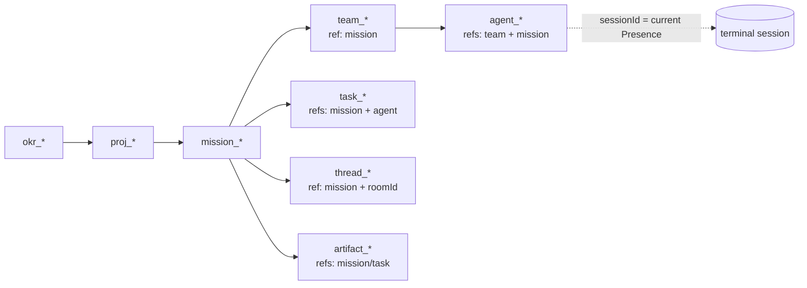
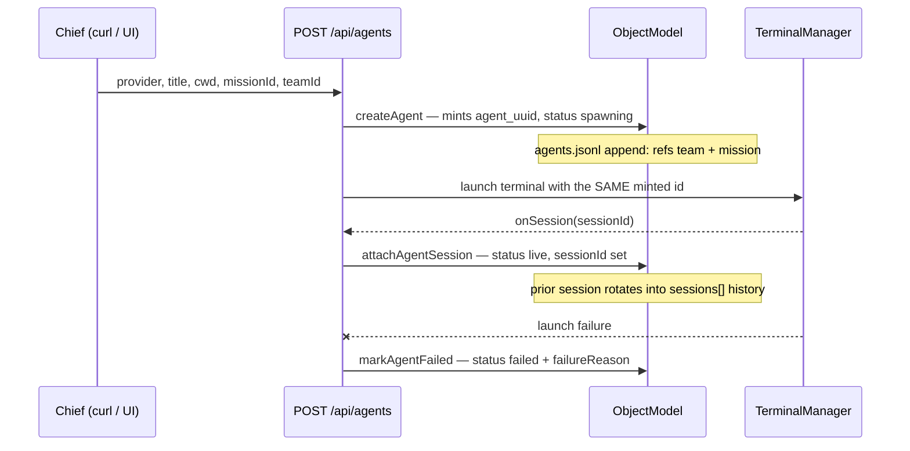

# Operating the Object Model

**Status:** Current · **Updated:** 2026-07-23 (mission_cli-process-map)
**Applies when:** Running a mission on the durable mission graph — creating
the mission/team, spawning agents with refs, moving tasks, linking the
mission room, recording artifacts.
**Owns:** the "how to follow it" procedure. The model itself is owned by
`src/backend/objectModel/index.ts`; store law by `AGENTS.md`.

Every command below is verified against the code or a real store row —
citations inline. Where a step has **no sanctioned surface today**, that is
stated plainly instead of inventing one (the coverage matrix in
`docs/reports/mission-lifecycle-map/` tracks these as build candidates).

## The graph at a glance



Hierarchy law: OKR → Project → Mission → Task (`AGENTS.md`). Team membership
is NOT stored on the team — it derives from Agent → team refs (single
authority, `AGENTS.md` teams.jsonl entry).

## 1. File the mission and team

Preferred path: one verb files the whole mission (mission + team + optional
task rows, validated refs, baseline enrollment) through the engine:

```bash
node scripts/nvk-mission.mjs create --dir .novakai/stores --id mission_<slug> \
  --title "…" --owner <chief> --project proj_<slug> --team-name "Team <Name>"
```

(`--task "<title>" --agent agent_<id>` adds task rows — only possible once the
mission's agents exist, see §3; `--dry-run` prints the exact rows first.)

Both rows are plain append-only blocks; the generic sanctioned append remains
valid as the row-at-a-time reference:

```bash
node scripts/nvk-store.mjs append --dir .novakai/stores --store missions.jsonl \
  --line '{"id":"mission_<slug>","kind":"mission","ts":"<ISO with offset>","title":"…","status":"todo","owner":"<chief>","refs":[{"kind":"project","value":"proj_<slug>"}]}'

node scripts/nvk-store.mjs append --dir .novakai/stores --store teams.jsonl \
  --line '{"id":"team_<slug>","kind":"team","ts":"<ISO with offset>","name":"Team <Name>","refs":[{"kind":"mission","value":"mission_<slug>"}]}'
```

- Verb contract: `scripts/nvk-store.mjs:5` (append), validation + baseline
  enrollment happen inside the engine (`src/backend/stores/store.mjs`
  `appendLine`).
- Real example row: `teams.jsonl` — `team_cli-process-map`
  (`{"kind":"team","refs":[{"kind":"mission","value":"mission_cli-process-map"}]}`).
- Exactly one mission ref per team (`AGENTS.md` teams.jsonl law).

## 2. Spawn agents with mission + team refs

One call does everything: `POST /api/agents` with `missionId` + `teamId`
mints the durable Agent id and persists the block **before** the PTY exists
(ruling S4 — a session callback can never target a missing record).

```bash
curl -s -X POST http://127.0.0.1:3031/api/agents \
  -H 'Content-Type: application/json' \
  -d '{"provider":"kimi","title":"Manager Kimi <X>","cwd":"/path/to/worktree",
       "missionId":"mission_<slug>","teamId":"team_<slug>"}'
```



- Mission context resolution: `src/backend/server/missionSpawn/index.ts:24-31`
  — both `missionId` and `teamId` required together, else 400.
- Session attach (automatic, idempotent): `src/backend/server/agents.ts:80`;
  failure path: `src/backend/server/agents.ts:306`.
- Status machine: `spawning → live → failed/retired`
  (`src/backend/stores/schema.mjs:97`).
- **Gaps to know:** `scripts/nvk-agent.mjs spawn` does NOT pass
  `missionId`/`teamId` (flags are `--provider --title --cwd --brief
  --brief-file` only, `scripts/nvk-agent.mjs:75-79`) — mission spawns are
  curl/API-only today. Nothing in the codebase writes `status:"retired"`
  (schema allows it; no writer) — retire is manual today.
- Stagger multiple spawns ~2 min apart
  (`issue_simultaneous-spawn-session-attach-race`, issues.jsonl).

## 3. Create and move tasks

Task creation has no dedicated verb (verified: `ObjectModel.createTask` has
zero external callers) — use the generic append. Transitions have a
sanctioned, intent-named CLI verb — never hand-edit:

```bash
# create (generic append; refs: mission required, and M1 write-strict law makes
# the agent ref REQUIRED on every NEW mission task — the agent's own mission ref
# must agree (validate.mjs validateTaskAuthority; legacy agentless rows are
# audit-exempt). Corollary: tasks for a brand-new mission can only be filed
# AFTER its agents exist — file mission + team, spawn agents, then file tasks.)
node scripts/nvk-store.mjs append --dir .novakai/stores --store tasks.jsonl \
  --line '{"id":"task_<slug>","kind":"task","ts":"<ISO>","title":"…","status":"todo","updated":"<ISO>","refs":[{"kind":"mission","value":"mission_<slug>"},{"kind":"agent","value":"agent_<uuid>"}]}'

# transition (locked, CAS, validated; updated moves strictly forward)
node scripts/nvk-store.mjs transition-task --dir .novakai/stores \
  --id task_<slug> --status doing
node scripts/nvk-store.mjs transition-task --dir .novakai/stores \
  --id task_<slug> --status blocked --reason "waiting on X"
```

- Verb contract: `scripts/nvk-store.mjs:6,194`. Statuses:
  `todo|doing|done|blocked`; `blockedReason` is only legal while blocked and
  requires `--reason` (`AGENTS.md` tasks.jsonl law).
- Real example rows: `tasks.jsonl` — `task_lifecycle-map`,
  `task_cli-coverage-matrix` (this mission's own task blocks).

## 4. Link the mission room (thread)

The typed mission↔messaging link is API-served:

```bash
curl -s -X POST http://127.0.0.1:3031/api/threads \
  -H 'Content-Type: application/json' \
  -d '{"roomId":"room_<id>","missionId":"mission_<slug>"}'
```

- Route: `src/backend/messaging/index.ts:162` →
  `src/backend/messaging/threads/index.ts:37`
  (`graph.createThread({ roomId, missionId })`, 201 with `threadId`).
- One thread block per mission room; `roomId` is a runtime identifier,
  deliberately unchecked (`AGENTS.md` threads.jsonl law).

## 5. Record artifacts

`ObjectModel.recordArtifact` exists but has no route or CLI caller
(verified) — record produced outputs with the generic append:

```bash
node scripts/nvk-store.mjs append --dir .novakai/stores --store artifacts.jsonl \
  --line '{"id":"artifact_<slug>","kind":"artifact","ts":"<ISO>","title":"…","path":"docs/…","refs":[{"kind":"mission","value":"mission_<slug>"}]}'
```

- Law: exactly one of `path`/`url`, at least one mission/task ref
  (`AGENTS.md` artifacts.jsonl entry; enforced by the schema layer).

## 6. Watch and verify the graph

```bash
# the mission graph, server-derived (agents, tasks, health, thread)
curl -s http://127.0.0.1:3031/api/missions/mission_<slug>/snapshot

# store integrity — run before claiming any store work done
npm run stores:audit
npm run stores:gate
```

- Snapshot route: `src/backend/missionView/index.ts:72`. The Mission Room UI
  ("Mission Room · read-only snapshot" in Mission Control) renders this same
  graph — team progress, agent statuses, task rollup.
- Membership shown there derives from Agent refs, so an agent spawned
  WITHOUT mission context (plain spawn) will not appear — that is the
  designed `'unknown'` case (`src/backend/objectModel/index.ts:100`), not a
  bug.

## Quick reference — write-surface reachability

| Domain intent | Sanctioned surface today | Evidence |
|---|---|---|
| Create mission / team | `nvk-mission.mjs create` (one verb, whole filing) | scripts/nvk-mission.mjs:2; generic append remains the row-at-a-time fallback |
| Spawn agent w/ refs | `POST /api/agents` + missionId/teamId | missionSpawn/index.ts:24-31 |
| Attach session | automatic | agents.ts:80 |
| Mark launch failure | automatic | agents.ts:306 |
| Create task | generic `nvk-store.mjs append` | zero callers of `createTask` |
| Transition task | `nvk-store.mjs transition-task` | nvk-store.mjs:6,194 |
| Thread link | `POST /api/threads` | messaging/threads/index.ts:37 |
| Record artifact | generic `nvk-store.mjs append` | zero callers of `recordArtifact` |
| Retire agent | none (schema allows, no writer) | schema.mjs:97; no `'retired'` writer in src/ or scripts/ |
| Inspect graph | `GET /api/missions/:id/snapshot`, Mission Room UI | missionView/index.ts:72 |

Hand-editing store files remains forbidden in every case (`AGENTS.md`).
