# Mission Lifecycle Map — how a mission actually runs today

**Mission:** mission_cli-process-map · **Updated:** 2026-07-23
**Evidence base:** the completed `mission_mission-object-model` packet
(accepted 2026-07-23, PR #46), corroborated by `mission_studio-tab-cleanup`
and `mission_messages-tab-v1`; static censuses of every `nvk-*` CLI, all 53
backend routes, and the ObjectModel write surface; live store rows; live-app
screenshots. All raw evidence with re-runnable generator scripts:
[`evidence/`](evidence/).

**Reading the diagrams:** solid wires carry a verbatim command observed in a
real mission packet (cited). **Dashed wires are stages that happened with no
command trail** — evidenced by documents or store rows only. That solid/dashed
split IS the coverage story.

---

## 1. The whole lifecycle at a glance

```mermaid
flowchart LR
    A[Direction<br/>from Chris] --> B[Contract +<br/>packet + EXP]
    B -.no command trail.- C[Mission + team<br/>filed in stores]
    C --> D[Spawn +<br/>onboard team]
    D --> E[Plan +<br/>plan audit]
    E --> F[Build +<br/>oversight]
    F --> G[Verify:<br/>gates + browser]
    G --> H[Correct +<br/>final audit]
    H --> I[Accept +<br/>close out]
    I -.no command trail.- J[Team retire +<br/>store records]
    style A fill:#d0a14b,color:#121214
    style J stroke-dasharray: 5 5
```

Nine of the lifecycle's steps run with **no observable command trail** (§5 of
[evidence/trace-commands.md](evidence/trace-commands.md)); the phase diagrams
below show exactly where.

---

## 2. Phase diagrams — with the exact commands on the wires

### Phase 1 — Direction → Contract → filing

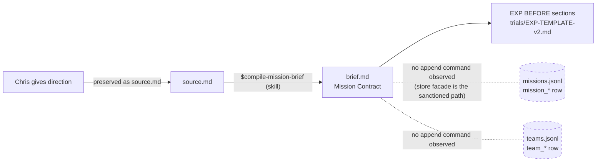

| Wire | Exact command | Evidence |
|---|---|---|
| Contract compilation | `$compile-mission-brief` (skill, not shell) | OM EXP:90 |
| Mission filing | none observed — "Mission recorded in store", id cited, command absent in all 3 packets | OM EXP:91; trace-commands.md §5 |
| Sanctioned (unused) path | `node scripts/nvk-store.mjs append --dir .novakai/stores --store missions.jsonl --line '<json>'` | scripts/nvk-store.mjs:5 |
| EXP timing | BEFORE sections at packet time — scheduled by the chain since this mission's fix | docs/operations/START-HERE.md loop step 3; CHIEF.md Part 2 step 6; confusion evidence: [evidence/exp-timing-evidence.md](evidence/exp-timing-evidence.md) |

### Phase 2 — Spawn and onboard the team

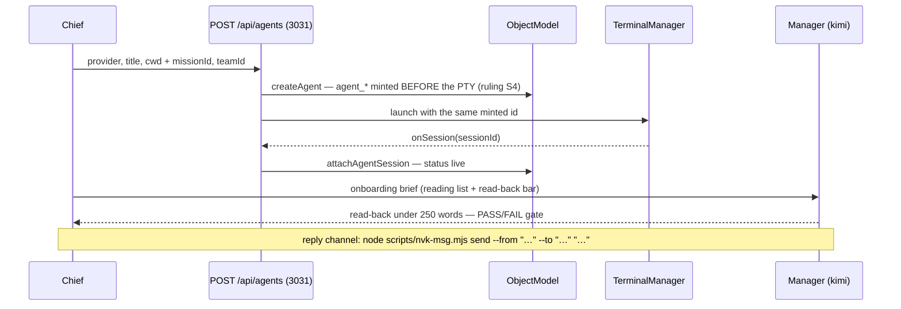

| Wire | Exact command | Evidence |
|---|---|---|
| Spawn (tool named, invocation never recorded) | `scripts/nvk-agent.mjs` spawn path; "nvk-agent spawn receipt" | OM EXP:71, 94; trace-commands.md §5 |
| Spawn (API, mission context) | `POST /api/agents` `{provider, title, cwd, missionId, teamId}` | src/backend/server/missionSpawn/index.ts:24-31; MT plan.md:18 |
| Spawn CLI ≠ mission spawn | `nvk-agent spawn` has no `--mission`/`--team` flags | scripts/nvk-agent.mjs:75-79 (census: cli-census.json) |
| Worker read-back reply | `node scripts/nvk-msg.mjs send --from "Worker Opus ObjectModel" --to "Manager Kimi ObjectModel" "..."` | OM onboard-worker.md:31 |
| Spawn confirmation | `GET /api/agents/:id/identity`; brief delivery confirmed via the agent's own transcript | OM result.md:41; scripts/nvk-agent.mjs:104-106 |
| Race caution | stagger simultaneous spawns ~2 min | issue_simultaneous-spawn-session-attach-race |

**Live example of the durable result** — this mission's own agents rows: a
first `Manager Kimi Map` block `status:"retired"` superseded by the live one,
plus `Worker Opus Scribe` `status:"live"`, each with team + mission refs
([evidence/store-rows.md](evidence/store-rows.md)).

### Phase 3 — Plan, audit, authorize

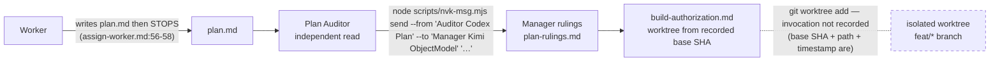

Evidence: OM audit-plan-brief.md:49; build-authorization.md:10-13;
containment.log:1-4 (base SHA `286f143a`, worktree path, created
2026-07-22T10:52:15Z — command absent).

### Phase 4 — Build with oversight

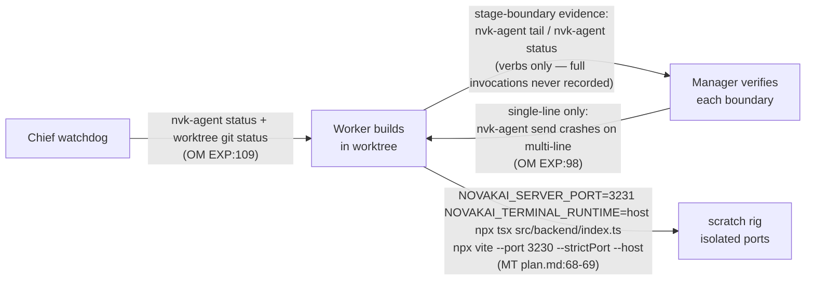

Oversight tooling that exists but shows only verb-level trail: `nvk-agent
status|tail`, `nvk-oversee once|watch`, `nvk-watchdog tick|watch`,
`nvk-status [--all]` (full contracts: evidence/cli-census.json).

### Phase 5 — Verification (the richest stage by far)

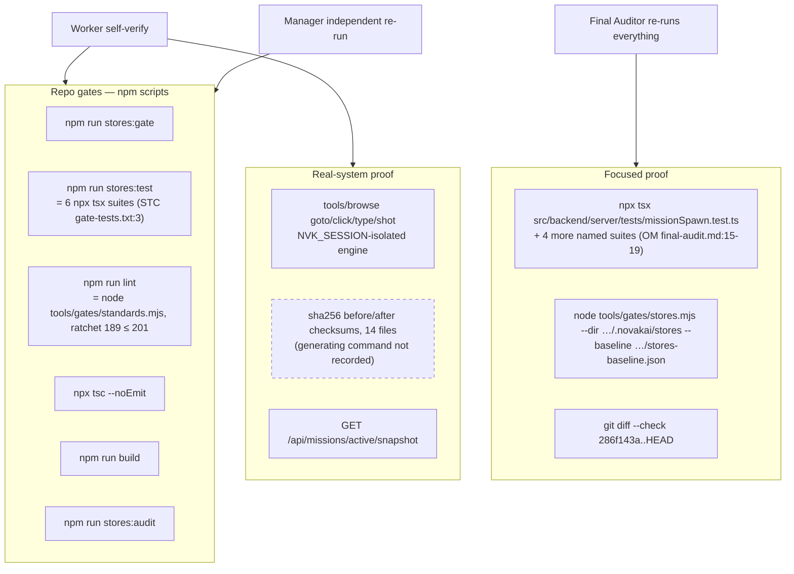

Every box cited in [evidence/trace-commands.md](evidence/trace-commands.md)
census rows 9-24, 33-38, 45, 47. The house law visible in the wires: **three
independent parties run the same gates** (Worker, Manager, Auditor) — a
receipt from the layer below is never accepted as proof.

### Phase 6 — Correct, accept, close out

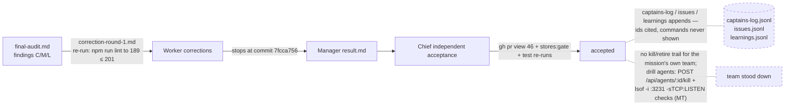

Evidence: OM correction-round-1.md:47; EXP:122-124; containment.log:25; MT
plan.md:367-369, evidence/before/NOTES.md:17-19.

---

## 3. Where the app is in the loop (live screenshots, 2026-07-23)

Captured driving the live lane (single node process, pid-verified via lsof,
serving snapshot `0f794df6` on 3030/3031).

**Mission Control — the messaging spine.** #team feed, DM lanes, phase rail,
mission health; agents onboard, report back, and get corrected here.

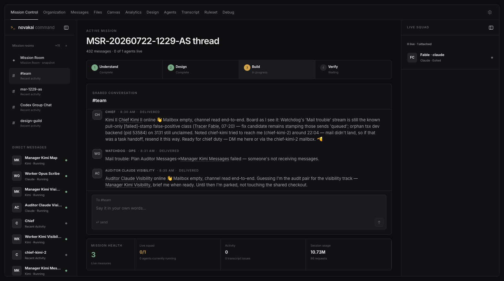

**Mission Room — the object model rendered.** The read-only snapshot of
`GET /api/missions/:id/snapshot`: pulse, phase, team progress with per-agent
status pulled straight from agents.jsonl refs.

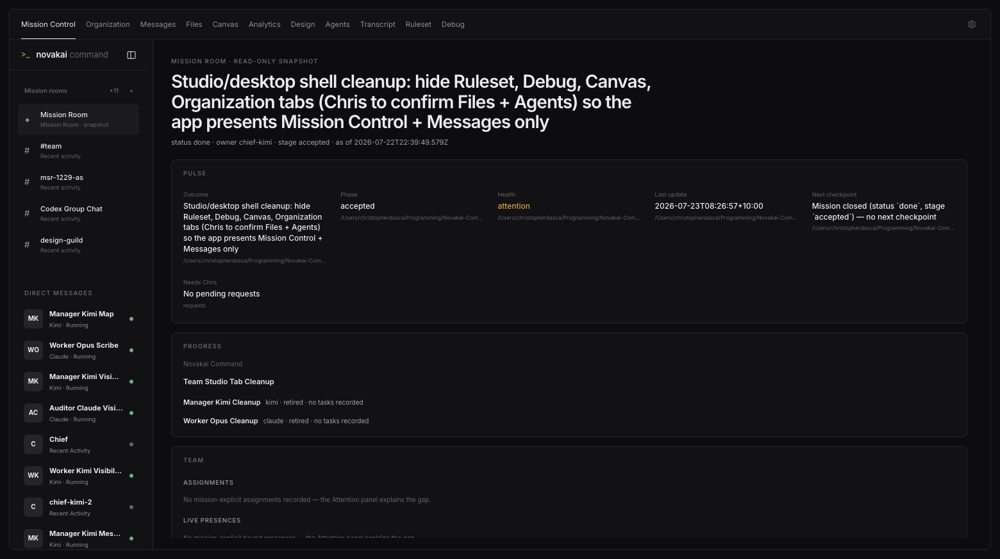

**Agents — the Presence surface.** Roster of PTY sessions, per-agent
Context/Conversation/Tunnel/Evidence panels; spawn entry point ("New agent").

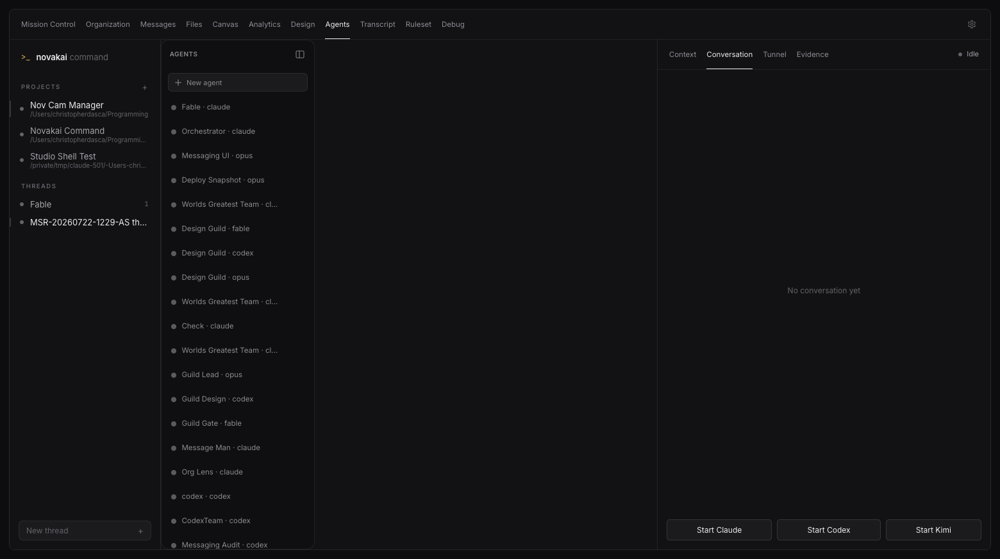

---

## 4. The command surface — CLI + backend module map

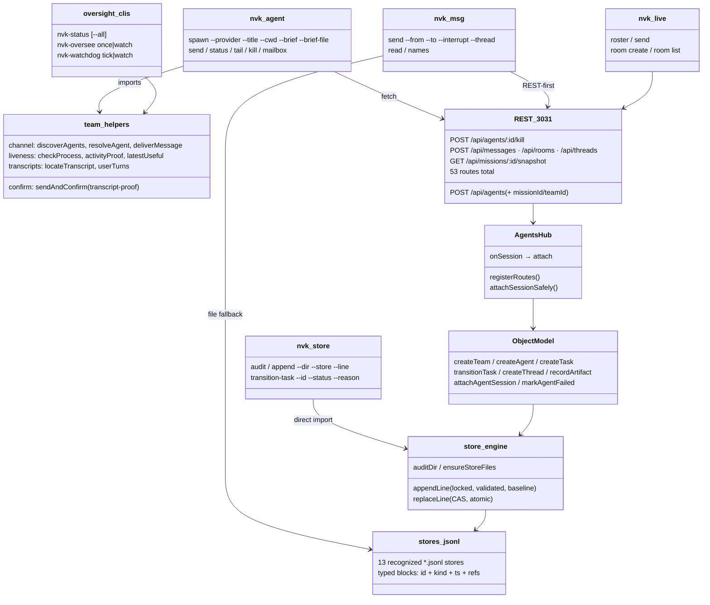

Dependency direction holds everywhere: scripts → backend API → ObjectModel →
engine → files, with two sanctioned bypasses — `nvk-store.mjs` imports the
engine directly (`scripts/nvk-store.mjs:19`), and `nvk-msg.mjs` falls back to
the journal file when the backend is down. Full inventories:
[evidence/cli-census.json](evidence/cli-census.json),
[evidence/route-census.json](evidence/route-census.json),
[evidence/store-census.json](evidence/store-census.json).

---

## 5. Coverage matrix — every lifecycle action → surface today

Classes: **CLI** (dedicated verb) · **generic-CLI** (raw JSON through
`nvk-store append`) · **API-only** (curl required) · **auto** (no operator
action) · **manual** (no tool surface) · **GAP** flags where the current
state costs accuracy or effort. Every row cites current state; no "should
exist" rows.

| # | Lifecycle action | Surface today | Evidence | Gap? |
|---|---|---|---|---|
| 1 | Compile Contract | skill `$compile-mission-brief` | OM EXP:90 | — |
| 2 | Build mission packet | manual file writes | packet files themselves | — |
| 3 | Create EXP w/ BEFORE | manual from template, now scheduled at packet time | START-HERE.md step 3 (this mission's fix) | — |
| 4 | File mission row | generic-CLI (`nvk-store append`); no trail observed in any packet | nvk-store.mjs:5; trace §5 | **GAP** — no `mission create` verb; hand-built JSON |
| 5 | Create team row | generic-CLI; `ObjectModel.createTeam` has zero callers | store-census.json; grep: no route/CLI | **GAP** — same |
| 6 | Spawn agent (plain) | CLI `nvk-agent spawn` (process+session+brief-delivery checks) / `POST /api/agents` | nvk-agent.mjs:74-119; MT plan.md:18 | — |
| 7 | Spawn agent (mission refs) | **API-only** — `nvk-agent spawn` has no mission/team flags | missionSpawn/index.ts:24-31; cli-census.json | **GAP** — every durable spawn is hand-rolled curl |
| 8 | Session attach (Presence) | auto — `AgentsHub.onSession` | agents.ts:80 | — |
| 9 | Launch-failure record | auto — `markAgentFailed` | agents.ts:306 | — |
| 10 | Onboard / brief delivery | CLI `nvk-agent spawn --brief-file` (transcript-confirmed) + `nvk-msg send` | nvk-agent.mjs:104-106; OM onboard-worker.md:31 | — |
| 11 | Messaging during mission | CLI `nvk-msg send/read/names`, `nvk-live send/room` | cli-census.json; OM briefs | single-line only: issue_nvk-agent-multiline-send-crash |
| 12 | Oversight / liveness | CLI `nvk-agent status/tail`, `nvk-oversee`, `nvk-watchdog`, `nvk-status` | cli-census.json; OM EXP:107-117 | trail is verb-level only (trace §6) |
| 13 | Create task rows | generic-CLI; `createTask` zero callers | store-census.json; live rows tasks.jsonl | **GAP** — no `task create` verb |
| 14 | Transition task | CLI `nvk-store transition-task` — exists, yet **zero usage trail in all three packets** | nvk-store.mjs:6,194; trace §5 | **GAP (adoption)** — sanctioned verb unused in practice |
| 15 | Thread link (mission↔room) | **API-only** — `POST /api/threads` | messaging/threads/index.ts:37 | — (single call, rarely repeated) |
| 16 | Record artifact | generic-CLI; `recordArtifact` zero callers | store-census.json | **GAP** — no verb; rows rarely written |
| 17 | Mission status transitions | none — `transition-task` is tasks-only; no mission transition surface | nvk-store.mjs:194; store-census.json | **GAP** |
| 18 | Verification gates | CLI — `npm run stores:gate/audit/test`, `lint`, `build`, `npx tsx <suite>`, `npx tsc --noEmit` | trace census rows 9-23, 33-35 | — (the best-covered stage) |
| 19 | Browser verification | CLI — `tools/browse` verbs, NVK_SESSION-isolated | OM plan.md:298-301; MT plan.md:74-75 | worktrees need node_modules (observed this mission) |
| 20 | Scratch-rig bring-up | manual env-var recipe | MT plan.md:68-69 | — (documented recipe) |
| 21 | Containment checksums | manual — hashes recorded, command never | containment.log:11-66 | minor |
| 22 | Worktree creation | manual `git worktree add` — invocation never recorded | containment.log:1-4; trace §5 | minor |
| 23 | Kill agent (Presence) | CLI `nvk-agent kill` (verified exit) / `POST /api/agents/:id/kill` | nvk-agent.mjs:150-164; MT plan.md:367 | — |
| 24 | Retire agent (durable status) | none — schema allows `retired`, **no writer exists** | schema.mjs:97; grep src+scripts | **GAP** |
| 25 | Stand down mission team | manual — no trail for any mission's own team | trace §5 | **GAP** |
| 26 | Close-out store records (log/issues/learnings) | generic-CLI; ids cited, commands never observed | trace §5; EXP:124 | **GAP** — no close-out verb |
| 27 | PR opening | manual — `gh pr view` observed, creation never | EXP:124; trace §5 | minor |
| 28 | Inspect mission graph | API `GET /api/missions/:id/snapshot` + Mission Room UI | missionView/index.ts:72; screenshot 2 | — |

> Incoming change, not yet landed at census time (2026-07-23): 
> `mission_external-session-visibility` plans to add a `register` verb to
> `scripts/nvk-agent.mjs` (external-session registration into the object
> model) — per Manager Kimi Visibility via Manager Kimi Map. The census
> re-run at delivery reflects whichever state is true then.

**Shape of the current state:** execution-side actions (spawn, message,
verify, kill) are well-covered by dependable CLIs; **the durable object model
is written almost entirely through hand-built JSON or not at all** — 9 of 28
actions are GAP-class, and 8 of those 9 are store-graph writes. Chris's "95%
via CLIs" belief measures true for execution, not for the graph.

---

## 6. Ranked follow-up CLI build missions

Rank = how often the action recurs per mission × observed friction/risk.
Every item cites its matrix row and trace evidence.

1. **`nvk mission` — file a mission end-to-end** (rows 4, 5, 13). One verb
   creating mission + team + task rows with validated refs, replacing three
   hand-built JSON lines per mission. Recurs every mission; the filing stage
   currently has zero command trail (trace §5) and JSON handwriting is the
   drift vector the store gate keeps catching.
2. **Mission-context spawn in `nvk-agent`** (row 7). Add `--mission`/`--team`
   flags passing missionId/teamId to the existing POST; today every durable
   spawn is a hand-rolled curl (captains-log ck2-002 shows Chiefs doing
   exactly this). Small change, hits every mission, removes the last curl
   from the standard flow; a natural home for the 2-min stagger guard too.
3. **`nvk close-out` — accept and record** (rows 26, 17, 25). One verb for
   the close-out bundle: captains-log entry, issues/learnings appends,
   mission status transition, team stand-down. The entire close-out stage is
   currently trail-less (trace §5) and runs on the most senior, most
   context-loaded agent (the Chief) — highest cost of a hand-slip.
4. **Task-transition adoption** (rows 13, 14). `transition-task` exists and
   is CAS-guarded, yet no packet shows it used; Mission Room renders "no
   tasks recorded" for real missions (screenshot 2). Likely a wiring mission
   (surface it in the operator path — e.g. `nvk-agent`/Manager tooling — and
   the Mission Room), not a new writer.
5. **`nvk artifact` + retire writer** (rows 16, 24). Record artifacts at
   result-filing time and give `retired` its missing writer so the durable
   graph reflects reality after missions end. Lower frequency than 1-4 but
   closes the last no-writer statuses in the schema.
6. **Command-trail capture for packets** (trace §5's nine silent stages,
   row 21-22). A tiny evidence helper (e.g. `nvk log-cmd` appending verbatim
   commands to the packet) so future process archaeology doesn't need
   reconstruction. Cheap; multiplies the value of every future review.

Per the Contract, these are proposals for Chris — to be filed as `todo`
missions in missions.jsonl only after he sees this list.

---

## 7. Chief input (Contract item: what-worked / what-didn't / what's-unclear)

> **Slot open — pending relay from the Chief** (Contract: "Chief supplies
> it"). To be incorporated as cited quotes when received; the mission does
> not close this item silently.

---

## 8. Method and evidence

| Evidence file | What it proves | Regenerate |
|---|---|---|
| [cli-census.json](evidence/cli-census.json) | 7 CLIs, 26 verbs, every flag, with file:line | `node evidence/cli-census.mjs .` |
| [route-census.json](evidence/route-census.json) | all 53 routes, method+path+file:line | `node evidence/route-census.mjs .` |
| [store-census.json](evidence/store-census.json) | ObjectModel write surface, engine exports, schema law | `node evidence/store-census.mjs .` |
| [trace-commands.md](evidence/trace-commands.md) | 47 cited command rows, stage sequence, 9 no-trail stages, drift notes | greps in its §1 |
| [store-rows.md](evidence/store-rows.md) | live store rows for both missions | grep in its header |
| [exp-timing-evidence.md](evidence/exp-timing-evidence.md) | where the EXP timing confusion lived | greps in its header |
| [assets/](assets/) | live-app screenshots, 2026-07-23 | `~/.claude/browse` drive |

Related deliverable: [docs/operations/OBJECT-MODEL-OPERATIONS.md](../../operations/OBJECT-MODEL-OPERATIONS.md)
— the operating procedure for the durable graph that §5's gap rows point at.
